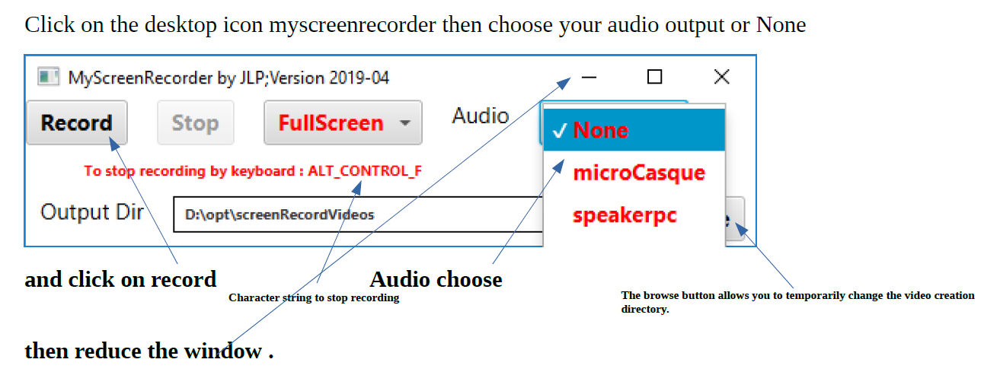

# myscreenrecorder 

<H1>Context</H1>

Under Windows, I could not (or did) find simple free software to
make screenshots and audio as video. Very useful for tutorials for
example. There are some free but the recording time is limited or
there is a watermark inserted at the beginning and end of the
recording. Others generate uncompressed (very large) avi files
with a size limit of 2 GB. Under Linux, I know at least 2: -
RecordMyDesktop =&gt;
http://recordmydesktop.sourceforge.net/downloads.php  -
SimpleScreenRecorder =&gt;
https://www.maartenbaert.be/simplescreenrecorder/ Although my
software can run under Linux, I will focus instead on its use on
Windows. I provide all the operating modes and scripts to make it
work also under Linux, without details. 

<H1><B>Myscreenrecorder</B></H1>

This application is just a <B>ffmpeg graphic front end </B>for
recording the screen and possibly audio through a microphone or
through the speakers used (headphones or pc specific).  <B>ffmpeg
is behind the scene, no need to know and play with it.</B>  In
addition to the software already mentioned, I also use a library
(provided with the github package) interface JNI JnativeHook
available here =&gt;
https://github.com/kwhat/jnativehook/releases/download/2.1.0/jnativehook-2.1.0.zip
 The others logicials are : 
<ul>
<li> FFMPEG static :
https://ffmpeg.zeranoe.com/builds/win64/static/ffmpeg-latest-win64-static.zip
<li> Open JFX 11 :
http://gluonhq.com/download/javafx-11-0-2-sdk-windows/ 
<li> OpenJDK 11
:
https://download.java.net/java/GA/jdk11/9/GPL/openjdk-11.0.2_windows-x64_bin.zip
</ul>
  <B>To install , download the zip project from here, and read
the manual under manuals directory ( English and french) to finalize
the installation and the configuration</B>

